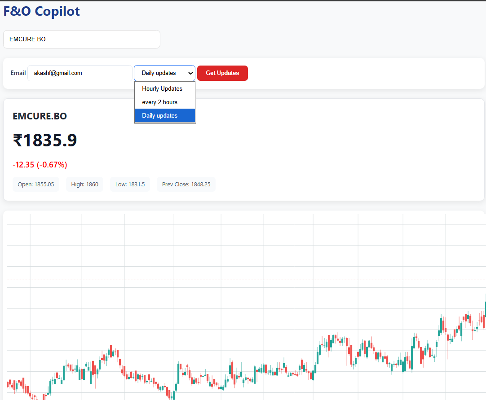
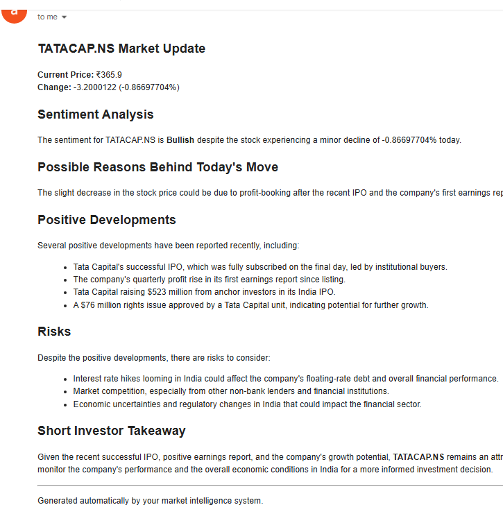
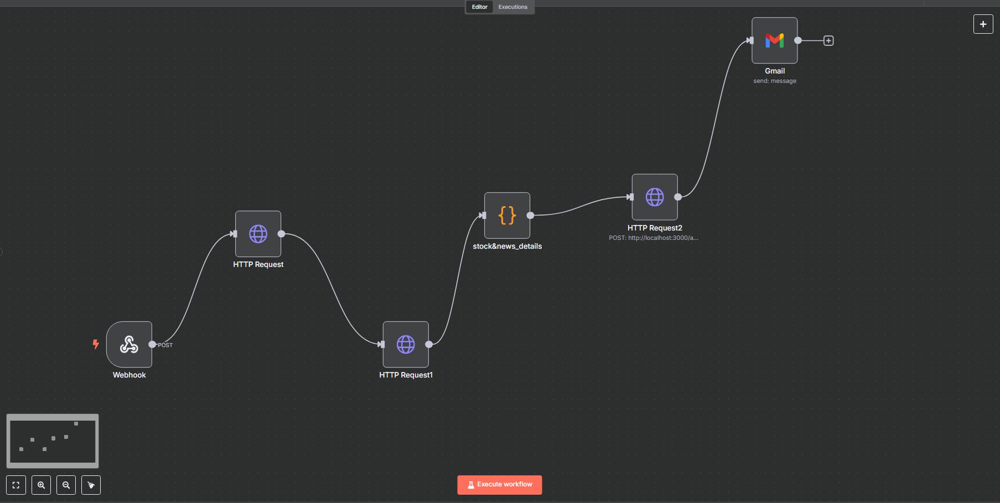

# F&O Copilot 📈

An AI-powered market intelligence platform that delivers automated stock analysis reports directly to investors' inboxes.

Users can subscribe to their favorite stocks and receive periodic market updates enriched with sentiment analysis, recent developments, risk factors, and AI-generated investor takeaways.

---


## Features

- Real-time stock price retrieval using Yahoo Finance
- AI-powered sentiment analysis using LLMs
- Automated market intelligence report generation
- Email delivery through Gmail integration
- Subscription support with multiple frequencies:
  - Hourly updates
  - Every 2 hours
  - Daily updates
- Interactive candlestick chart visualization
- Workflow automation using n8n

---

## Screenshots

### Dashboard



### Email Report


### Workflow



---

## Tech Stack

### Frontend
- HTML5
- CSS3
- JavaScript

### Backend
- Node.js
- Express.js

### AI Layer
- Gemini API
- Groq API

### Market Data
- Yahoo Finance API

### Automation
- n8n Workflow Automation

### Notifications
- Gmail API

---

## System Architecture

```text
User
 ↓
Frontend Dashboard
 ↓
Express Backend
 ↓
n8n Workflow Engine
 ├── Market Data Fetching
 ├── News Aggregation
 ├── AI Analysis Generation
 └── Email Delivery
 ↓
Investor Inbox
```

---

## Workflow Overview

1. User enters a stock ticker.
2. User provides an email address.
3. User selects update frequency.
4. Market data is fetched from Yahoo Finance.
5. Relevant news articles are collected.
6. Gemini and Groq generate sentiment analysis and insights.
7. A structured market report is generated.
8. The report is delivered directly to the subscriber's email inbox.

---

## Example Report Sections

- Market Summary
- Sentiment Analysis
- Possible Reasons Behind Today's Move
- Positive Developments
- Risks
- Investor Takeaway

---

## Installation

Clone the repository:

```bash
git clone https://github.com/akash-1969/ai-news-generator.git
cd ai-news-generator
```

Install dependencies:

```bash
npm install
```

Create a `.env` file:

```env
GEMINI_API_KEY=your_gemini_api_key
GROQ_API_KEY=your_groq_api_key
```

Start the backend server:

```bash
node backend/server.js
```

Open:

```text
http://localhost:3000
```

---

## Project Structure

```text
project/
│
├── backend/
│   ├── server.js
│   ├── gemini.js
│   ├── groq.js
│   └── subscriptions.json
│
├── frontend/
│   ├── index.html
│   ├── script.js
│   └── styles.css
│
├── package.json
├── package-lock.json
└── .env
```

---

## Future Improvements

- Deployment using Vercel and Render
- Multi-stock portfolio monitoring
- WhatsApp and Telegram notifications
- Technical indicator integration
- Options chain analysis
- Earnings calendar alerts
- Personalized watchlists
- Vector database powered historical reasoning

---

## Why F&O Copilot?

Traditional investing platforms provide raw data.

F&O Copilot focuses on transforming market data into actionable intelligence by combining:

- Market data
- News analysis
- Large Language Models
- Workflow automation

into a single investor experience.

---

## Author

Akash Shrivastava

GitHub:
https://github.com/akash-1969
